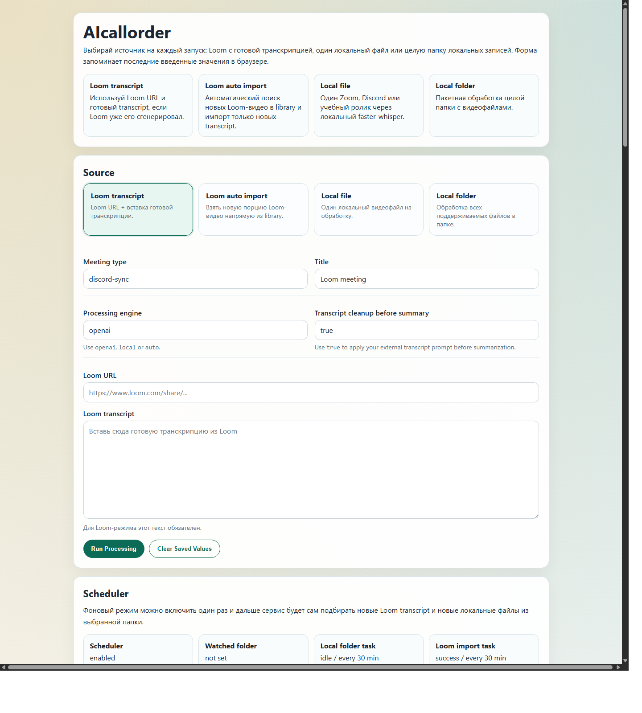
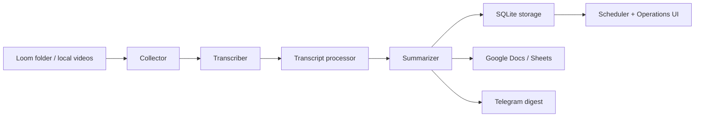

# AIcallorder

AIcallorder is a local-first automation service for turning Loom recordings and local meeting videos into structured delivery artifacts:

- meeting summaries
- action items
- tech debt notes
- business requests for estimation
- technical spec drafts
- Telegram digests
- Google Docs / Google Sheets records

The project is designed around a practical workflow:

- Loom stores videos and provides transcripts when available
- local videos can be transcribed with local Whisper
- GPT/OpenAI or local LLMs generate structured outputs
- results are published to Telegram and Google Workspace
- a web UI controls imports, scheduling, and cleanup



For repository presentation assets and ready-to-paste GitHub metadata, see:

- `docs/GITHUB_SHOWCASE.md`
- `docs/RELEASE_TEMPLATE.md`
- `assets/social-preview.svg`

## What It Does

AIcallorder helps a team process engineering and business meetings without manual copy-paste work.

Supported scenarios:

- auto-import new Loom videos from a selected Loom folder
- filter Loom videos by title keywords and date
- process a single local video file
- process a whole local folder
- generate meeting-level and daily digests
- store processed state locally in SQLite
- skip already processed Loom videos
- manage scheduler runs from the browser

## Main Capabilities

- `Loom auto import` via Selenium login and transcript extraction
- `Local file` and `Local folder` processing via local Whisper/faster-whisper
- `OpenAI API` or local LLM summarization
- transcript preprocessing through custom prompt files
- Telegram notifications with Loom and Google Doc links
- Google Docs and Google Sheets publishing
- built-in scheduler for recurring Loom and local-folder runs
- operations dashboard for processed records and run logs

## Architecture



## Web Interface

After the service starts, open:

```text
http://127.0.0.1:8000
```

The UI includes:

- source selection for Loom, local file, and local folder
- LLM provider selection: `openai`, `local`, `auto`
- Loom keyword and date filters
- scheduler configuration
- run-now actions
- processed records view
- run logs view
- local cleanup actions

## Quick Start

### 1. Install dependencies

```powershell
python -m venv .venv
.\.venv\Scripts\activate
pip install -r requirements.txt
```

### 2. Create local config

Copy `.env.example` to `.env` and fill in the values you actually use.

Minimal example:

```env
APP_ENV=development
DATABASE_URL=sqlite:///data/loom_automation.db

LOOM_EMAIL=
LOOM_PASSWORD=
LOOM_HEADLESS=false
LOOM_LIBRARY_URL=https://www.loom.com/looms/videos

LLM_PROVIDER=openai
LLM_API_KEY=
LLM_BASE_URL=https://api.openai.com/v1
LLM_MODEL=gpt-4.1-mini
LLM_TIMEOUT_SECONDS=120

LOCAL_WHISPER_MODEL=medium
PREFER_LOCAL_WHISPER_FOR_LOCAL_FILES=true

GOOGLE_SERVICE_ACCOUNT_JSON=
GOOGLE_DOC_ID=
GOOGLE_SHEETS_ID=
GOOGLE_SHEETS_WORKSHEET=Transcript

TELEGRAM_BOT_TOKEN=
TELEGRAM_CHAT_ID=
```

### 3. Run the web app

```powershell
python -m uvicorn loom_automation.main:app --host 127.0.0.1 --port 8000
```

Then open:

```text
http://127.0.0.1:8000
```

## Local Always-On Mode for Windows

To use the project only through the browser and avoid starting it manually each time:

### Start background web server

```powershell
powershell -ExecutionPolicy Bypass -File .\scripts\start_web.ps1
```

### Open dashboard

```powershell
.\scripts\open_dashboard.cmd
```

### Stop web server

```powershell
powershell -ExecutionPolicy Bypass -File .\scripts\stop_web.ps1
```

Runtime files are stored in:

- `data/runtime/web.pid.json`
- `data/runtime/logs/uvicorn.stdout.log`
- `data/runtime/logs/uvicorn.stderr.log`

## Windows Auto Start

Enable auto start after login:

```powershell
.\scripts\install_startup.cmd
```

Disable auto start:

```powershell
.\scripts\uninstall_startup.cmd
```

## Linux VPS Deployment

Recommended Linux production mode for Loom import:

- `LOOM_HEADLESS=false`
- `Xvfb` virtual display
- regular Chrome instead of strict headless mode
- system-installed `chromedriver`
- persistent Chrome profile via `CHROME_USER_DATA_DIR`

Server deployment assets are included in:

- `deploy/linux/README.md`
- `deploy/linux/install_runtime_ubuntu.sh`
- `deploy/linux/systemd/aicallorder-xvfb.service.example`
- `deploy/linux/systemd/aicallorder-web.service.example`

Useful Linux env values:

```env
LOOM_HEADLESS=false
CHROME_BINARY=/usr/bin/google-chrome
CHROMEDRIVER_PATH=/usr/local/bin/chromedriver
CHROME_USER_DATA_DIR=/opt/aicallorder/data/chrome-profile
CHROME_WINDOW_SIZE=1600,1200
CHROME_EXTRA_ARGS=
```

## Temporary Public URL Without VPS

If you need temporary external access before moving to VPS, the project can be exposed through a tunnel.

Cloudflare Quick Tunnel scripts are included:

- `scripts/start_tunnel.ps1`
- `scripts/stop_tunnel.ps1`
- `scripts/show_tunnel_url.ps1`

Quick Tunnel depends on Cloudflare availability and may time out on some networks.

A temporary alternative tunnel may also be used while the local web app is running.

Important:

- the machine must stay online
- the URL is temporary
- this is useful for testing, not long-term production

## Loom Workflow

Recommended production logic for this project:

1. Use Loom transcript for Loom-hosted videos.
2. Use local Whisper for local files and fallback cases.
3. Route transcript cleanup through your custom prompt files.
4. Generate structured artifacts with OpenAI or local LLM.
5. Publish results to Telegram and Google Workspace.

## Loom Filters and Prompt Routing

The project supports filtering by title and routing by meeting type.

Examples:

```env
LOOM_TITLE_INCLUDE_KEYWORDS=#daily,Yavdokimenko,заказ,оплат
LOOM_TITLE_EXCLUDE_KEYWORDS=tutorial,demo,обучение
TRANSCRIPT_PREPROCESS_ENABLED=true
```

Prompt routing config:

- `promts/prompt_routes.json`

Default transcript cleanup prompt:

- `promts/promts_transcription.txt`

This allows different prompt behavior for:

- daily syncs
- business requirement discussions
- implementation planning
- training content
- technical review sessions

## LLM Providers

The summarizer supports provider-based execution:

- `LLM_PROVIDER=openai`
- `LLM_PROVIDER=local`
- `LLM_PROVIDER=compatible`
- `LLM_PROVIDER=auto`

Recommended default for production quality:

```env
LLM_PROVIDER=openai
LLM_API_KEY=...
LLM_BASE_URL=https://api.openai.com/v1
LLM_MODEL=gpt-4.1-mini
```

Local fallback remains available through:

- `LOCAL_LLM_COMMAND`
- local Whisper for local files

## Google Workspace Setup

To publish results to Google Docs and Google Sheets:

1. Create or reuse a service account JSON file.
2. Share the target Google Doc and Google Sheet with that service account.
3. Fill these variables in `.env`:

```env
GOOGLE_SERVICE_ACCOUNT_JSON=C:\path\to\service-account.json
GOOGLE_DOC_ID=
GOOGLE_SHEETS_ID=
GOOGLE_SHEETS_WORKSHEET=Transcript
```

The project can:

- update a master Google Doc with structured meeting notes
- update a Google Sheet row by `loom_video_id`

## Telegram Setup

Set:

```env
TELEGRAM_BOT_TOKEN=
TELEGRAM_CHAT_ID=
```

The project sends:

- meeting digest messages
- daily digest messages

Telegram output includes:

- Loom link
- Google Doc link
- document section title

## Scheduler

Built-in scheduler supports:

- recurring Loom import
- recurring local-folder processing
- active time windows
- browser-based management

Key config values:

```env
SCHEDULER_ENABLED=true
SCHEDULER_MEETING_TYPE=discord-sync
SCHEDULER_LOCAL_FOLDER_ENABLED=false
LOCAL_VIDEO_FOLDER=
SCHEDULER_LOCAL_FOLDER_MINUTES=30
SCHEDULER_LOOM_ENABLED=true
SCHEDULER_LOOM_MINUTES=30
SCHEDULER_LOOM_LIMIT=20
SCHEDULER_ACTIVE_FROM=08:00
SCHEDULER_ACTIVE_TO=21:00
SCHEDULER_ACTIVE_WEEKDAYS=mon,tue,wed,thu,fri
```

Scheduler state is stored in:

- `data/scheduler_settings.json`

## Processed Records and Run Logs

The project stores processed-state locally in SQLite:

- `data/loom_automation.db`

This database controls deduplication.

Important:

- clearing Google Sheets does not reset processed-state
- processed Loom videos are tracked locally
- run history is tracked separately in local run logs

The browser UI now supports:

- viewing recent processed meetings
- viewing recent run logs
- deleting one processed record
- clearing processed records
- clearing run logs

## Repository Safety

The repository is prepared for public publishing with local secrets excluded by `.gitignore`.

Ignored items include:

- `.env`
- `data/`
- `.venv/`
- `.vendor/`
- `.pydeps/`
- `scripts/*.json`

## Project Structure

```text
loom_automation/
  integrations/
  modules/
  pipelines/
  config.py
  main.py
  scheduler.py
  workflow.py

promts/
  prompt_routes.json
  promts_transcription.txt

scripts/
  start_web.ps1
  stop_web.ps1
  install_startup.cmd
  uninstall_startup.cmd
  start_tunnel.ps1
  stop_tunnel.ps1
  show_tunnel_url.ps1
```

## Current Status

Implemented:

- Loom auto import
- local transcription fallback
- OpenAI-based summarization
- Google Docs / Sheets publishing
- Telegram digests
- browser UI
- scheduler
- run logs and processed-record management
- temporary external access support

Planned improvements:

- stronger prompt routing by meeting class
- richer Google Doc formatting
- better production deployment flow for VPS
- stable named tunnel or domain-based external access

## License

MIT
